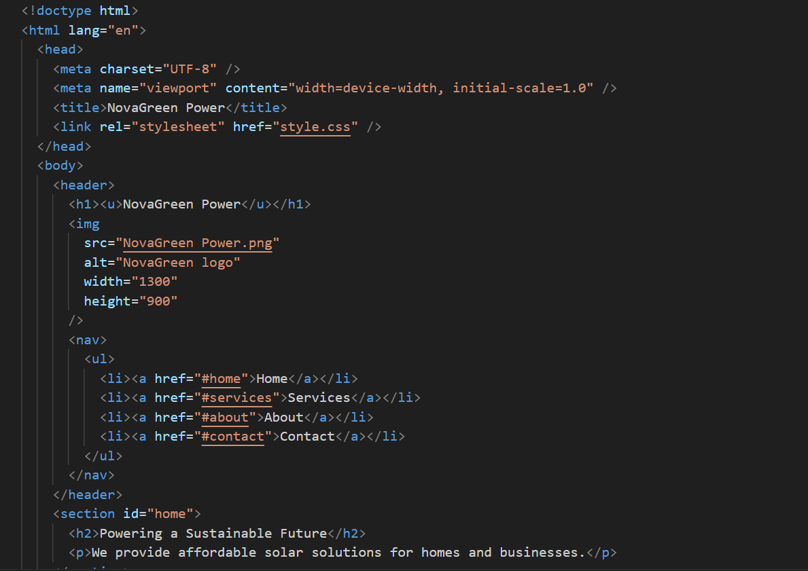
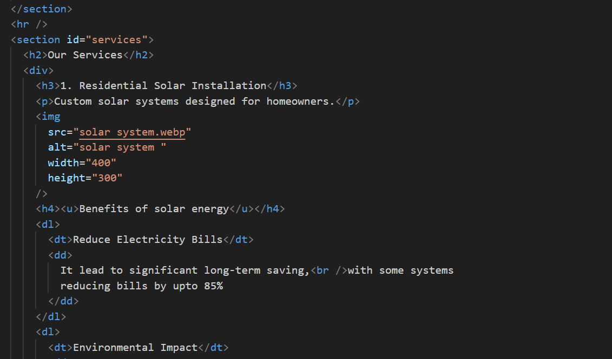
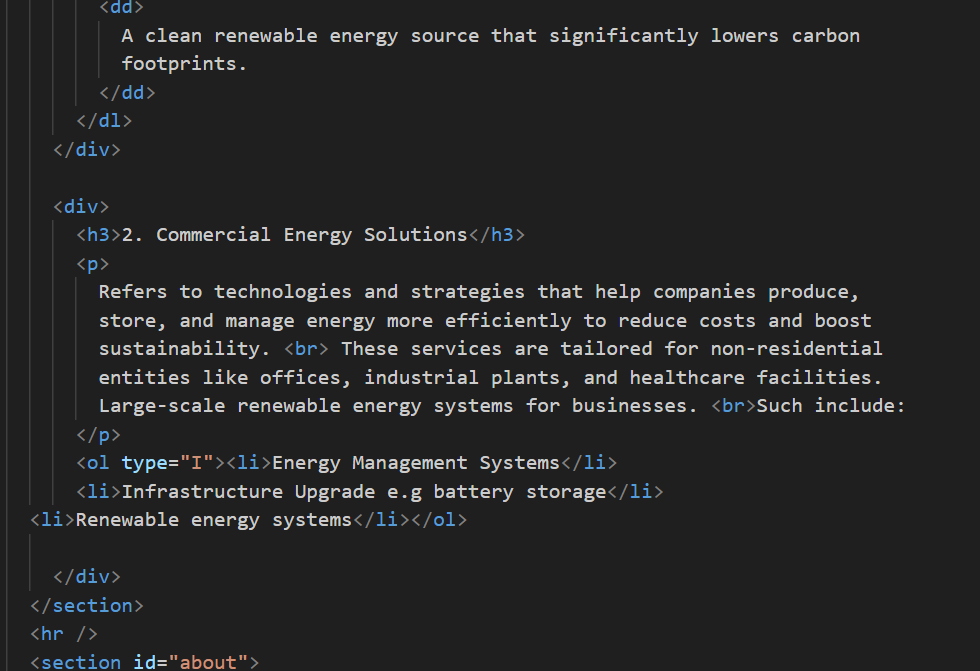

#NovaGreen Power
 

##1.Project Brief
>This project is a responsive professional landing page developed for a fictional renewable energy company called _NovaGreen Power_.
 
The objective of the project is to design and implement a structured, semantic HTML5 website that represents a real-world business.

##2.Technologies Used
>HTML5 – For semantic structure and content organization. 
CSS-for styling.

##3.Business Rationale
>NovaGreen Power is a fictional renewable energy company created to simulate a realistic business scenario. 
The renewable energy sector was chosen because it reflects global sustainability trends and provides a clear service-based structure suitable for a professional landing page. 
The company focuses on:
1.Residential solar installation
2.Commercial energy solutions

##screenshots
  

